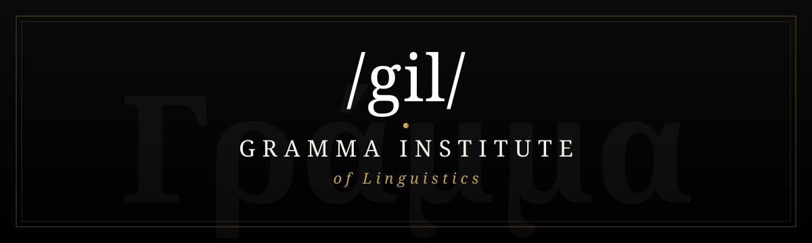

<div align="center">



<br/>

# Gramma Institute · `/gil/`

**Plataforma web institucional multilíngue para um instituto internacional de línguas**

_Site público elegante (tipografia Didot, preto & branco) · Painel administrativo completo · Conteúdo 100% gerível · Multilíngue com tradução automática_

<br/>


</div>

<div align="center"></div>

## Índice

- [Visão Geral](#visão-geral)
- [Quanto Vale um Site Como Este](#quanto-vale-um-site-como-este)
- [Demonstração](#demonstração)
- [Funcionalidades](#funcionalidades)
- [Stack Tecnológica](#stack-tecnológica)
- [Arquitectura](#arquitectura)
- [Instalação Local](#instalação-local)
- [Acesso de Administrador](#acesso-de-administrador)
- [Idiomas](#idiomas)
- [Deploy em Produção](#deploy-em-produção)
- [Estrutura de Rotas](#estrutura-de-rotas)
- [Autor](#autor)

<div align="center"></div>

## Visão Geral

O **Gramma Institute** é um sistema web profissional, seguro e totalmente editável, criado para uma
instituição internacional de ensino de línguas clássicas e modernas. Junta um **site público**
de estética editorial (tipografia Didot, layout preto & branco, vídeo hero com transições suaves)
a um **painel administrativo** onde **cada bloco de conteúdo** — cursos, glossário, eventos,
parceiros, recursos, página "About Us" e configurações — é gerível sem tocar em código.

| | |
|---|---|
| **Tipo** | Site institucional + CMS sob medida |
| **Domínio** | Educação / Linguística |
| **Público-alvo** | Alunos, investigadores e parceiros internacionais |
| **Idiomas** | Português 🇧🇷 · English 🇺🇸 · Español 🇪🇸 (com tradução automática) |
| **Estado** | Em produção |

<div align="center"></div>

## Quanto Vale Este Projeto

Estimativa baseada no que está **realmente implementado neste repositório** — não são
valores genéricos. Âmbito real medido no código:

| Métrica | Valor |
|---|---:|
| Rotas definidas (`routes/web.php`) | 81 |
| Controladores | 26 |
| Modelos Eloquent | 11 |
| Migrações | 25 |
| Vistas Blade (público + admin) | 40 |
| Idiomas (PT/EN/ES) · chaves de tradução | 3 · 146 |

### Esforço estimado por área (do que existe aqui)

| Área | Horas |
|---|---:|
| Front-end & design B&W (Didot, responsivo, hero em vídeo, mega-menu, 20 vistas públicas) | ~55 h |
| Painel administrativo (AdminLTE, ~10 módulos CRUD, 20 vistas) | ~70 h |
| Arquitetura de conteúdo (11 modelos, 25 migrações, i18n em JSON, rota de media) | ~35 h |
| Multilíngue PT/EN/ES (146 chaves + tradução automática) | ~25 h |
| Autenticação, papéis, segurança e SMTP | ~15 h |
| Deploy e configuração de produção | ~10 h |
| **Total** | **~210 h** |

### Valor de mercado (≈ 210 h × taxa horária)

| Cenário | Taxa | 🇧🇷 BRL | 🇪🇺 EUR | 🇺🇸 USD |
|---|---|---:|---:|---:|
| Freelancer (média) | 80 / 25 / 30 | R$ 16.800 | € 5.250 | $ 6.300 |
| Freelancer sénior | 130 / 40 / 45 | R$ 27.300 | € 8.400 | $ 9.450 |
| Agência | 200 / 70 / 80 | R$ 42.000 | € 14.700 | $ 16.800 |

> O total = horas estimadas × taxa horária praticada. As horas refletem o âmbito real
> deste código; o valor final varia conforme a taxa e o contrato acordado.

<div align="center"></div>

## Demonstração

> As imagens abaixo apontam para o repositório. Para capturas de ecrã, adicione os ficheiros em `docs/`.

| Página Inicial | Detalhe de Curso (preto & branco) |
|---|---|
| Hero em vídeo com marca `/gil/`, grelha de cursos sensível ao toque | Layout minimalista, só conteúdo, letras brancas sobre preto |

| About Us (conteúdo limpo) | Painel Administrativo |
|---|---|
| Sub-páginas só com conteúdo, sem títulos nem ornamentos | AdminLTE com CRUD de todo o conteúdo |

<div align="center"></div>

## Funcionalidades

### 🏛️ Site Público
- **Hero em vídeo** com múltiplos clips, ordem gerível e transições cruzadas suaves (silencioso, com marca `/gil/`)
- **Grelha de cursos** sensível a qualquer toque no mobile (um toque abre o curso)
- **Detalhe de curso** em **preto & branco** — design editorial minimalista, só conteúdo
- **About Us** como sub-páginas independentes — conteúdo limpo, sem ornamentos
- **Glossário** de termos linguísticos com navegação por letra
- **Eventos** (próximos e passados) e **Promoções**
- **Parceiros** — grelha de logótipos/fotografias
- **Resources** — mega-menu com categorias e links externos diretos
- **WhatsApp** flutuante e troca de idioma em tempo real

### 🛠️ Painel Administrativo (AdminLTE)
- Dashboard com indicadores e manutenção do sistema
- CRUD completo: **Cursos · Glossário · Eventos · Promoções · Parceiros · Recursos · Hero Slides**
- Editor da página **About Us** (singleton) com todos os campos traduzíveis
- **Configurações do site**: tipografia, logos, hero, redes sociais, SMTP
- **Gestão de idiomas** + **editor de traduções** com **tradução automática**
- Upload de media servido via rota dedicada (robusto em Windows/Linux)

### 🌍 Multilíngue
- Idiomas públicos: **pt_BR**, **en**, **es** (tradução automática via MyMemory)
- Ficheiros em `lang/{locale}/` · middleware `SetLocale` por sessão
- Conteúdo dinâmico traduzível (colunas JSON com fallback `locale → pt_BR → en`)

### 🔒 Segurança
- CSRF em todos os formulários · middleware `auth` e `admin`
- Form Requests com validação estrita · uploads validados
- Senhas com Hash (bcrypt) · `.env` nunca versionado

<div align="center"></div>

## Stack Tecnológica

| Camada | Tecnologia |
|---|---|
| Framework | Laravel 12.x |
| Linguagem | PHP 8.2+ |
| Base de dados | MySQL 8.x |
| Front-end público | Bootstrap 5.3 + CSS sob medida (Didot / Bodoni Moda) |
| Painel admin | AdminLTE 3.2 (Bootstrap 4.6) |
| Ícones | Font Awesome 6.5 |
| Drag & drop | SortableJS |
| Tradução automática | MyMemory Translation API |
| Build | Vite / NPM |

<div align="center"></div>

## Arquitectura

```
app/
├── Http/Controllers/
│   ├── PublicController.php        # todas as páginas públicas
│   ├── MediaController.php         # serve media de storage (cross-platform)
│   └── Admin/                      # CRUD: Courses, Glossary, Events, Partners,
│                                   #       Resources, HeroSlides, About, Settings, Languages
├── Models/                         # SiteSetting, Course, GlossaryTerm, Event,
│                                   # Partner, ResourceCategory, ResourceLink,
│                                   # HeroSlide, Promotion, AboutPage (singletons + JSON i18n)
resources/views/
├── layouts/public.blade.php        # navbar, mega-menu, footer, hero controller
├── layouts/adminlte.blade.php      # layout do painel
└── public/                         # home, course-show, about-*, partners, resources, ...
lang/{pt_BR,en,es}/                 # ficheiros de tradução
routes/web.php                      # rotas públicas + grupo admin
docs/                               # banner e ornamentos do README
```

<div align="center"></div>

## Instalação Local

```bash
# 1. Clonar
git clone https://github.com/alexissanz/grammainstitute.git
cd grammainstitute

# 2. Dependências
composer install
npm install

# 3. Ambiente
cp .env.example .env
php artisan key:generate

# 4. Base de dados (editar credenciais no .env) e seeders
php artisan migrate --seed

# 5. Storage + build
php artisan storage:link
npm run build
```

`.env` essencial:

```env
APP_URL=http://localhost/public
DB_CONNECTION=mysql
DB_HOST=127.0.0.1
DB_PORT=3306
DB_DATABASE=db_grammaao
DB_USERNAME=user_dbgrammaao
DB_PASSWORD=user_dbgrammaao
FILESYSTEM_DISK=public
```

<div align="center"></div>

## Acesso de Administrador

| Campo | Valor |
|---|---|
| Email | `admin@gmail.com` |
| Senha | `123456789` |
| Login | `/login` |
| Painel | `/dashboard` |

<div align="center"></div>

## Idiomas

| Código | Idioma | Direção | Estado |
|---|---|---|---|
| `pt_BR` | Português (Brasil) | LTR | ✅ Público |
| `en` | English | LTR | ✅ Público |
| `es` | Español | LTR | ✅ Público |

**Trocar idioma:** `/lang/{locale}` (ex.: `/lang/en`, `/lang/es`)

<div align="center"></div>

## Deploy em Produção

O projeto está em produção em **DreamHost** (hospedagem partilhada). Fluxo resumido:

```bash
# 1. Build local → tarball dos ficheiros alterados
# 2. Backup remoto antes de substituir
# 3. Upload via pscp/scp e extração no servidor
# 4. php artisan migrate --force
# 5. php artisan config:clear && view:clear && cache:clear
# 6. Smoke-test das URLs (curl -I → HTTP 200)
```

O serviço de media usa a rota `/media/{path}` em vez do symlink `public/storage`,
garantindo compatibilidade em servidores onde o symlink não é seguido.

<div align="center"></div>

## Estrutura de Rotas

### Público
```
GET /                     → Início
GET /about                → About Us (índice)
GET /about/{section}      → About Us (sub-páginas: who-is, the-institute, mission, ...)
GET /courses              → Cursos
GET /courses/{slug}       → Detalhe do curso
GET /glossary             → Glossário
GET /events               → Eventos
GET /partners             → Parceiros
GET /resources            → Recursos
GET /contact              → Contacto
GET /lang/{locale}        → Trocar idioma
GET /media/{path}         → Servir media
```

### Admin (`auth` + `admin`)
```
GET  /dashboard
.../admin/settings · about · partners · resources · hero-slides
.../admin/courses · glossary · events · promotions   (CRUD completo)
.../admin/languages · translations/{locale} · auto-translate
```

<div align="center"></div>

## Autor

<div align="center">

**Alexandre Cristóvão**
Full-Stack Developer

[](https://www.linkedin.com/in/alexandre-crist%C3%B3v%C3%A3o-156073151/)
[](https://github.com/alexissanz)

<br/>


_Gramma Institute — Instituto Internacional de Línguas_
`/gil/`

</div>
